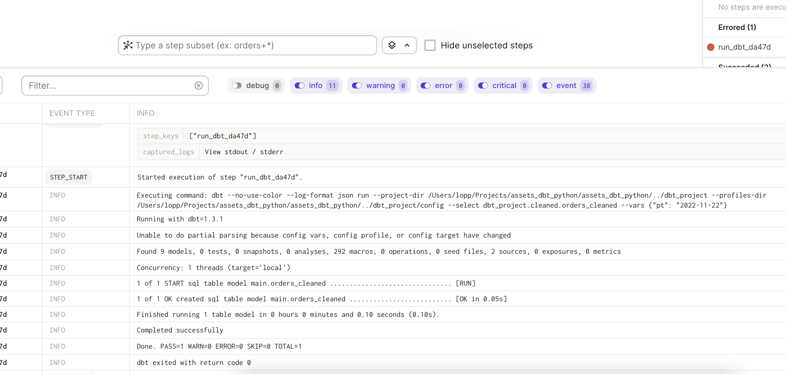
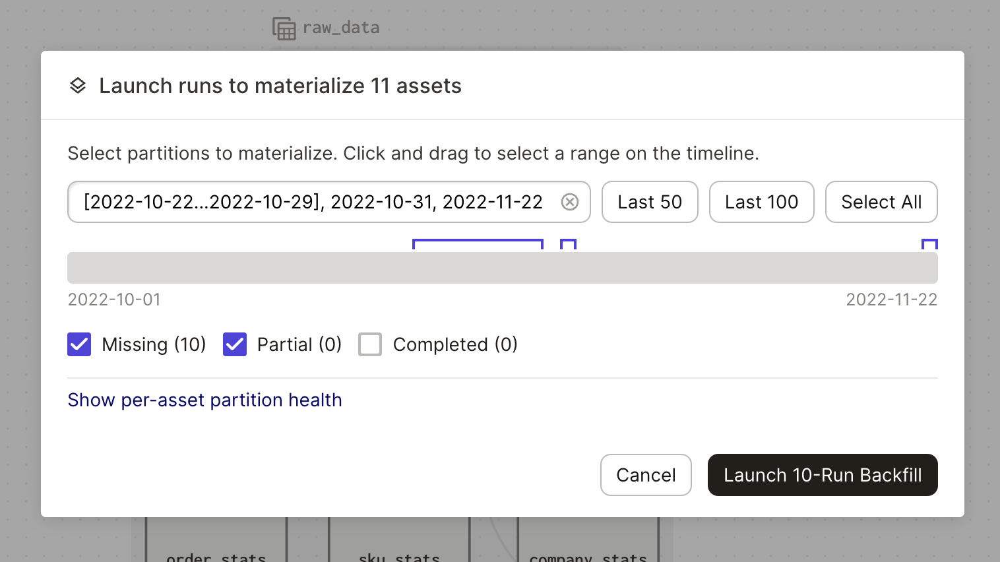

# dbt Partitioned Assets

This example shows how to use partitions with dbt assets.

The main change is in how dbt assets are loaded:

```
partition_def = DailyPartitionsDefinition(start_date = "2022-10-01")

def map_dagster_partition_to_dbt_run_var(partition_str): 
    return {"pt": partition_str}

dbt_assets = load_assets_from_dbt_project(
    DBT_PROJECT_DIR,
    DBT_PROFILES_DIR,
    partitions_def=partition_def,
    partition_key_to_vars_fn = map_dagster_partition_to_dbt_run_var
)
```

In this example, when the dagster dbt assets are materialized for the "2022-10-15" partition the dbt command will be:

```
dbt run --vars-'{"pt": "2022-10-15"} ... 
```



The dbt modes can then use this variable to intelligently to subselect certain data, e.g.:

```
select
    *, 
    my_expensive_func(my_column)

from my_data
where date == {{ var('pt') }} 
```

Using Dagster partitions lets you:

1. Run backfills across historical data when your code changes. If you change the SQL in your dbt model, you can update the new table across those partitions:



2. Create schedules automatically based on the partition:

```
update_dbt_job = define_asset_job(
    name = "update_dbt_job",
    # select the dbt assets
    selection = AssetSelection.groups("cleaned", "analytics", "marketing"),
    partitions_def=partition_def
)

update_dbt_daily = build_schedule_from_partitioned_job(
    update_dbt_job
)
```

